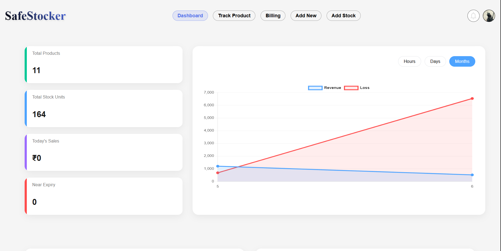
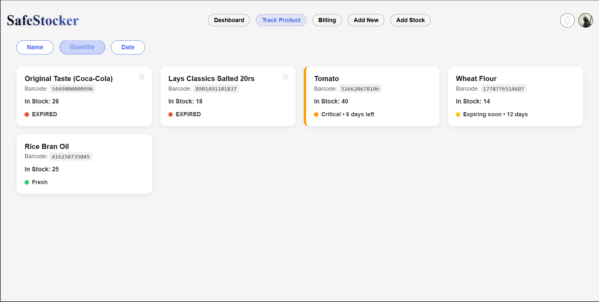
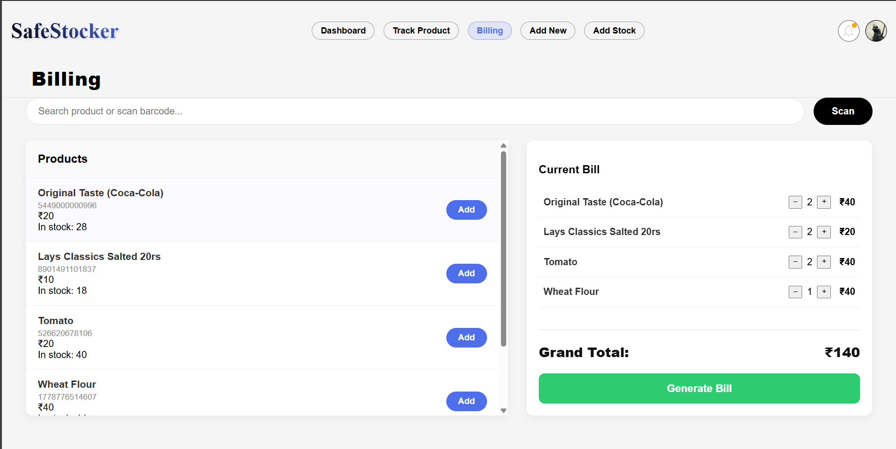
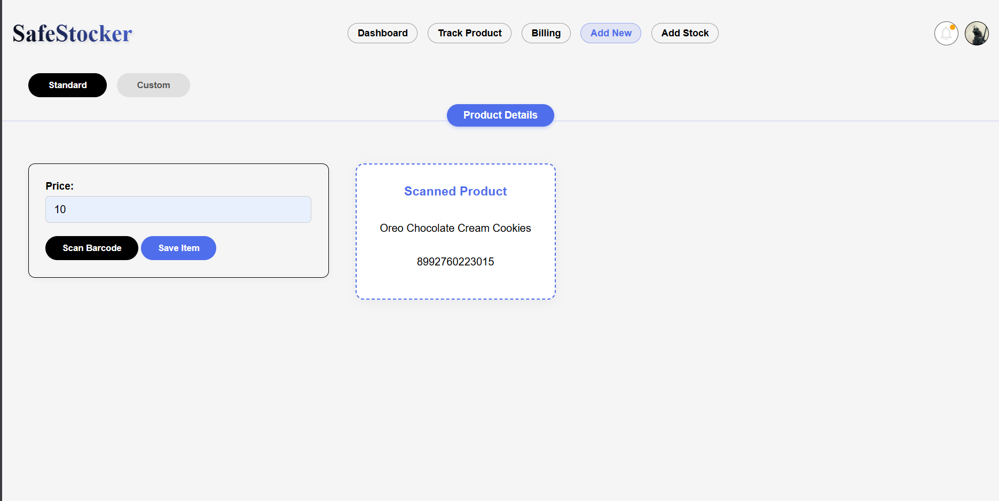
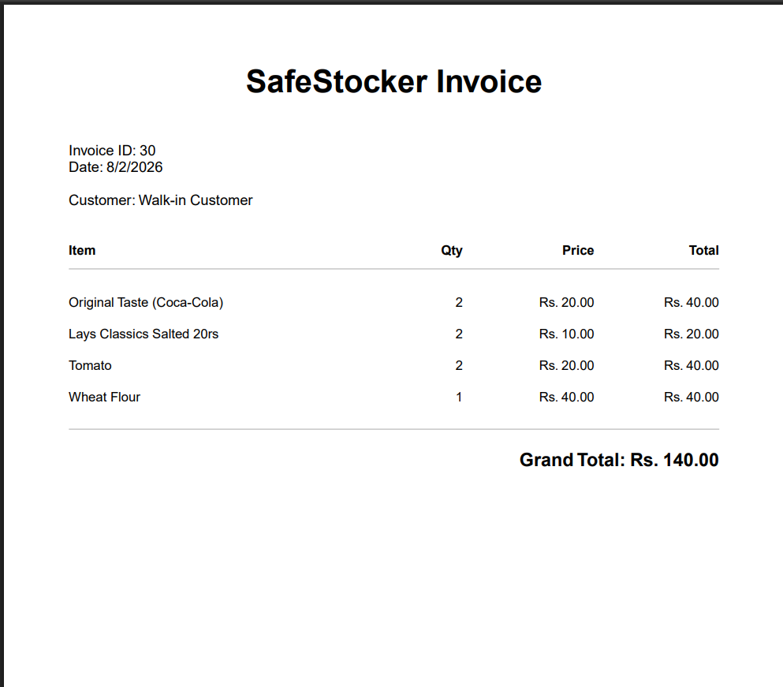
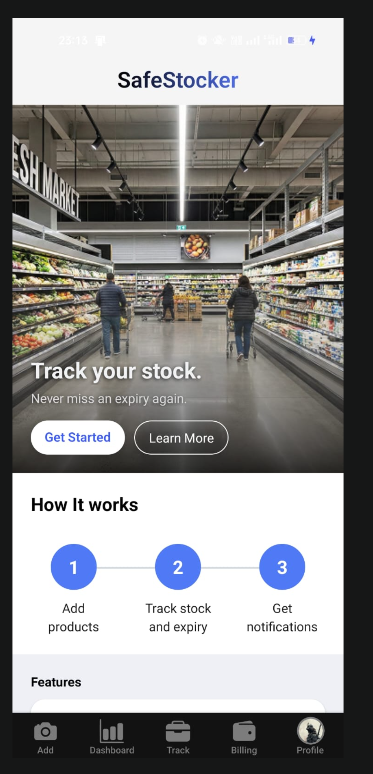
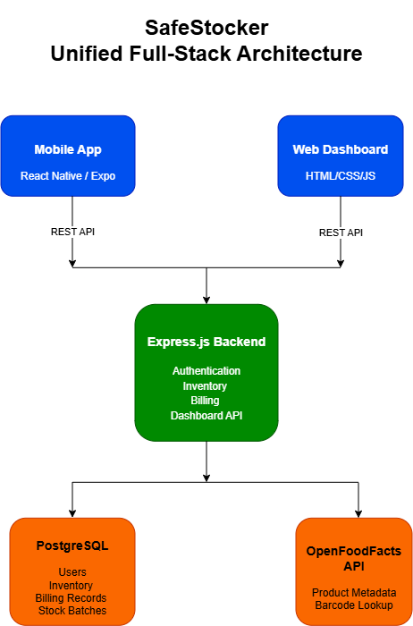

# 🛡️ SafeStocker

<div align="center">

## Full-Stack Inventory & Expiry Management Platform

🌐 Web Dashboard • 📱 React Native Mobile App • ⚙️ Express Backend • 🗄 PostgreSQL

Reduce stock wastage • Automate inventory • Generate invoices • Monitor business insights

<br />


</div>

## 📑 Table of Contents

- [Overview](#-overview)
- [Problem Statement](#-problem-statement)
- [Features](#-core-features)
- [Architecture](#-architecture)
- [Tech Stack](#%EF%B8%8F-tech-stack)
- [Project Structure](#-project-structure)
- [API](#-api-endpoints)
- [Installation](#-installation--setup)
- [Future Improvements](#-future-improvements)
- [License](#-license)

---

# ✨ Project Highlights

- Full-stack inventory management platform for web and mobile workflows
- Barcode-powered inventory onboarding with OpenFoodFacts lookup
- JWT + Google OAuth authentication for protected business data
- FIFO billing workflow that deducts oldest-expiring stock first
- Smart expiry tracking with freshness states, alerts, and loss recording
- PDF invoice generation for browser and mobile billing flows
- Revenue, sales, loss, and near-expiry analytics
- Shared Express backend serving both the web dashboard and mobile app
- Live deployment on Render with PostgreSQL persistence

---

# 📸 Application Preview

| Dashboard | Inventory |
|------------|-----------|
|  |  |

Dashboard overview and inventory workspace for tracking product availability, pricing, and stock status.

| Billing | Barcode Scanner |
|---------|-----------------|
|  |  |

Billing and barcode flows for faster checkout, product lookup, and inventory onboarding.

| Invoice | Mobile Application |
|---------|--------------------|
|  |  |

Invoice output and mobile entry point for billing, stock tracking, and on-the-go inventory workflows.

---

# 🏛 Architecture



SafeStocker is organized as a unified monorepo with one product experience across web, mobile, backend, and database layers. Recruiters can read the system as a straightforward product pipeline: users work from the web dashboard or mobile app, authenticated requests are handled by the Express backend, business data is persisted in PostgreSQL, and barcode lookups can call OpenFoodFacts when a scanned product is not already available locally.

| Layer | Role |
|---|---|
| 🌐 Web Dashboard | Browser-based inventory, billing, expiry tracking, analytics, and invoice workflows served from `/client`. |
| 📱 Mobile App | Expo + React Native application under `/mobile` for barcode scanning, inventory tracking, billing, analytics, and profile workflows on mobile devices. |
| ⚙ Shared Express Backend | Node.js + Express API under `/server` that handles authentication, inventory, barcode lookup, stock batches, billing, dashboard metrics, and protected business operations. |
| 🗄 PostgreSQL Database | Persistent relational data store for shops, items, stock batches, billing records, billing details, losses, categories, and suppliers. |
| 🔍 OpenFoodFacts Integration | External product lookup used when scanned barcodes are not already available in the local inventory database. |

> The shared backend keeps inventory, billing, expiry, and analytics data consistent between the browser dashboard and the mobile app.

## Data Flow

| Step | Flow | What Happens |
|---|---|---|
| 1 | Web Dashboard / Mobile App | Users authenticate, scan products, manage stock, generate bills, and review analytics. |
| 2 | Express Backend | REST endpoints validate JWTs, apply inventory and billing rules, and coordinate business workflows. |
| 3 | PostgreSQL | Shops, items, stock batches, billing records, losses, categories, and suppliers are stored persistently. |
| 4 | OpenFoodFacts API | Unknown scanned barcodes are resolved through an external product lookup before being added to inventory. |

---

# 📌 Overview

SafeStocker is a full-stack inventory management and expiry tracking platform designed for small retailers, grocery stores, pharmacies, warehouses, and local businesses.

The project focuses on reducing inventory losses caused by expired products while simplifying stock management, billing workflows, barcode onboarding, invoice generation, and business analytics.

SafeStocker consists of:

- 🌐 Web Dashboard
- 📱 React Native Mobile App
- ⚙ Shared Express Backend
- 🗄 PostgreSQL Database

The platform combines barcode-based product onboarding, expiry-aware stock management, billing automation, analytics dashboards, secure authentication, and intelligent inventory workflows into one unified system.

---

# 🌐 Live Deployment

| Resource | Details |
|---|---|
| Live Application | https://safestocker.onrender.com |
| Hosting Platform | Render |
| Database | PostgreSQL |
| API Architecture | Shared backend for web and mobile clients |

> The live deployment demonstrates the shared backend and browser dashboard. The mobile app connects to the same API through `EXPO_PUBLIC_API_URL`.

---

# 🚨 Problem Statement

Small businesses often struggle with:

- Manual inventory tracking
- Expired stock losses
- No automated expiry monitoring
- Difficult billing workflows
- Lack of real-time business analytics
- Human errors during stock handling
- Poor visibility into revenue vs losses

SafeStocker addresses these issues through automation, expiry-focused inventory logic, and a scalable modular architecture.

---

# 🎯 Project Objective

The objective of SafeStocker is to build a scalable inventory ecosystem that helps businesses:

- Reduce product wastage
- Improve inventory visibility
- Simplify billing operations
- Track expiring stock efficiently
- Analyze revenue and losses
- Support both desktop and mobile workflows

The long-term vision is to evolve SafeStocker into a complete SaaS-ready inventory and retail management platform.

---

# ✨ Core Features

## 🔐 1. Authentication & Security

### Google OAuth Authentication

- Secure login using Passport.js
- Web OAuth flow for the browser dashboard
- Mobile OAuth flow via Expo web browser support
- JWT token-based authentication
- Persistent session handling
- Deep link callback handling for mobile login

### Email & Password Authentication

- Shop owner account registration
- Secure login flow
- Protected API access
- Current-user lookup through authenticated routes

### Security Features

- JWT-protected routes
- Authorization middleware
- SQL parameterized queries
- Duplicate inventory prevention
- Transaction-safe billing workflows
- Protected invoice generation
- Secure mobile token storage with `expo-secure-store`

---

## 📦 2. Inventory Management

### Product Management

Users can:

- Add products
- Fetch registered inventory
- Categorize products
- Store pricing information
- Prevent duplicate barcode entries
- View products grouped by category in the mobile app
- Create products from barcode scans or manual entry

### Stock Batch Management

Each item supports:

- Multiple stock batches
- Quantity tracking
- Manufacture dates
- Expiry dates
- Batch-wise stock updates
- FIFO-aware stock tracking

### Stock Operations

Users can:

- Add stock entries
- Update quantities
- Remove stock batches
- View active stock only
- Search within categories
- Pull to refresh on mobile
- Sort inventory by expiry date, quantity, or alphabetical order

---

## 🔍 3. Barcode-Based Product System

SafeStocker supports barcode-powered product onboarding in both the web dashboard and mobile app.

### Barcode Scanning Workflow

- Real-time barcode scanning using device camera
- Mobile back-camera prioritization
- Duplicate scanner prevention
- Graceful camera permission handling
- Automatic barcode lookup workflow
- Support for barcode formats such as EAN-13, UPC-A, CODE128, and more

### Workflow

1. Scan barcode using the device camera.
2. Check the local database first.
3. Fetch product details using external APIs if unavailable locally.
4. Display product preview.
5. Add the product directly into inventory.

### Integrations

- OpenFoodFacts API
- ZXing Barcode Scanner Library
- `expo-camera` for native mobile scanning

---

## 🏷 4. Custom Product Registration

For products unavailable in external APIs, SafeStocker supports custom product creation.

### Custom Barcode Support

- Timestamp-based barcode generation
- Dynamic barcode preview generation
- Fully custom product creation
- Mobile barcode SVG generation with `jsbarcode` and `react-native-svg`

### Manual Product Entry

Users can manually define:

- Product name
- Barcode
- Category
- Price

This is useful for:

- Local products
- Wholesale inventory
- Medical supplies
- Non-packaged goods

---

## ⏰ 5. Expiry Tracking System

Expiry monitoring is one of the primary features of SafeStocker.

### Smart Expiry Monitoring

Products are color-coded based on freshness:

| Status | Meaning |
|---|---|
| 🟢 Green | Fresh stock |
| 🟡 Yellow | Expiring soon |
| 🟠 Orange | Critical expiry warning |
| 🔴 Red | Expired |
| ⚪ Gray | No expiry information |

Mobile category views also surface expiry-aware product lists with search, sorting, and pull-to-refresh support.

### Expiry Alert System

The application automatically:

- Detects near-expiry products
- Generates notifications
- Highlights affected inventory
- Displays alert dropdowns
- Redirects users to affected stock entries

### Expired Stock Handling

Expired inventory can:

- Be marked as lost
- Be removed from active inventory
- Be recorded for analytics

### Loss Tracking

The system records:

- Quantity lost
- Monetary loss amount
- Historical loss analytics

---

## 🧾 6. Billing & Invoice System

### Billing Workflow

Users can:

- Add products to cart
- Adjust quantities
- Cap billing quantities to available stock
- View live billing totals
- Generate invoices
- Share generated invoices from mobile devices

### First Expiry First Out

SafeStocker follows a First Expiry First Out billing strategy.

During billing:

- Oldest-expiring stock is deducted first
- Multiple stock batches are handled automatically
- Billing safely fails if stock is insufficient

This helps minimize:

- Product wastage
- Dead stock accumulation
- Expired inventory losses

### PDF Invoice Generation

Invoices are generated dynamically for web and mobile workflows.

| Platform | Invoice Flow |
|---|---|
| Web Dashboard | Server-generated PDF invoice streamed to the browser. |
| Mobile App | JSON billing response with on-device PDF generation through `expo-print` and sharing through `expo-sharing`. |

Invoice features include:

- Professional invoice layout
- Quantity and pricing breakdown
- Browser-streamed PDF download
- Dynamic billing rows
- Grand total calculations
- Mobile share sheet support for WhatsApp, email, save, and other installed apps

---

## 📊 7. Dashboard Analytics

SafeStocker provides real-time business insights across the web dashboard and mobile app.

### Dashboard Metrics

Displays:

- Total products
- Total stock quantity
- Today's sales
- Near-expiry stock count

### Revenue Analytics

Supports:

- Hourly mobile revenue filtering
- Weekly analytics
- Monthly analytics
- Yearly analytics

### Graph Visualizations

- Revenue trends
- Loss trends
- Sales analytics
- Revenue bar charts

### Order History

- Recent receipts
- Billing totals
- Purchase history
- Recent mobile orders list

### Revenue Insights

Highlights:

- Top-performing sales days
- High-revenue periods

---

# 📱 Mobile Application

The React Native mobile application is integrated directly into this monorepo under [`/mobile`](mobile). It extends SafeStocker into a native mobile workflow while using the same Express backend and PostgreSQL database as the web dashboard.

## Mobile Capabilities

- Email and password authentication
- Google OAuth mobile flow with deep link callback handling
- JWT persistence through `expo-secure-store`
- Category-based inventory browsing
- Barcode scanning with camera permissions
- Custom product creation
- Stock batch creation with manufacture and expiry dates
- Expiry-aware product cards
- Billing cart with live totals
- FIFO stock deduction through the backend
- On-device PDF invoice generation and sharing
- Dashboard analytics with revenue filters
- Account profile view
- Notification preference toggle
- Supplier management with validation and duplicate detection

## Mobile Backend Connection

| Property | Value |
|---|---|
| Live API | `https://safestocker.onrender.com` |
| Local API Variable | `EXPO_PUBLIC_API_URL` |
| Authentication | JWT + Google OAuth |
| Deep Link Callback | `safestocker://login` |

> The `EXPO_PUBLIC_` prefix is required by Expo to expose environment variables to the mobile client bundle.

---

# 🧱 Frontend Architecture

The web frontend follows a modular architecture for scalability and maintainability.

## Core Modules

### Core Layer

Handles:

- App initialization
- Global state management
- DOM utilities

### Services Layer

Handles:

- API communication
- Billing services
- Inventory services
- Stock services

### Events Layer

Handles:

- Billing events
- Dashboard interactions
- Form logic
- Stock operations

### Views Layer

Handles:

- UI rendering
- Dashboard rendering
- Billing screens
- Inventory cards

### Alerts Layer

Handles:

- Expiry notifications
- Alert generation
- Alert rendering

---

# 🗄 Database Design

SafeStocker uses PostgreSQL for persistent storage.

## Main Database Entities

- Shop
- Items
- Stock
- Billing
- BillingDetails
- Losses
- Categories
- Suppliers

## Relationships

- One shop → many items
- One item → many stock batches
- One bill → many billing details
- One stock batch → one loss record

---

# ⚙️ Tech Stack

## 🌐 Web

| Technology | Purpose |
|---|---|
| HTML5 | Web dashboard structure |
| CSS3 | Styling and responsive layout |
| Vanilla JavaScript | Client-side dashboard logic |
| ZXing Barcode Scanner | Browser barcode scanning |
| Chart.js | Analytics visualizations |

## 📱 Mobile

| Technology | Purpose |
|---|---|
| React Native 0.81 | Native mobile application framework |
| Expo SDK 54 | Mobile tooling, runtime, and development workflow |
| Expo Router | File-based navigation |
| TypeScript | Typed mobile application code |
| React Context API | Session and inventory state |
| Axios | HTTP client |
| expo-secure-store | Secure JWT persistence |
| expo-camera | Native camera barcode scanning |
| expo-print + expo-sharing | Mobile invoice PDF generation and sharing |
| jsbarcode + react-native-svg | Custom barcode rendering |
| expo-web-browser | Google OAuth browser flow |
| @react-native-community/datetimepicker | Native date picking |

## ⚙ Backend

| Technology | Purpose |
|---|---|
| Node.js | JavaScript runtime |
| Express.js | REST API server |
| Passport.js | Google OAuth authentication |
| JSON Web Tokens | Protected route authentication |
| PDFKit | Invoice PDF generation |
| EJS | Server-side templates |
| CORS | Cross-origin API access |
| dotenv | Environment configuration |

## 🗄 Database

| Technology | Purpose |
|---|---|
| PostgreSQL | Primary relational database |
| pg | Node.js PostgreSQL driver |
| SQL parameterized queries | Safer database operations |

## ☁ Deployment

| Platform | Purpose |
|---|---|
| Render | Production hosting |
| PostgreSQL | Managed database persistence |
| GitHub | Source control and repository hosting |

---

# 🧩 Project Structure

```bash
SafeStocker/
│
├── client/
├── server/
├── mobile/
├── docs/
│   │
│   ├── screenshots/
│   │   ├── dashboard.png
│   │   ├── inventory.png
│   │   ├── billing.png
│   │   ├── scanner.png
│   │   ├── invoice.png
│   │   └── mobile-home.png
│   │
│   └── architecture/
│       └── architecture.png
└── README.md
```

## Monorepo Directories

| Directory | Description |
|---|---|
| `client/` | Web dashboard assets, browser UI, barcode onboarding, billing screens, analytics views, and frontend services. |
| `server/` | Express backend, authentication, routes, controllers, middleware, services, templates, and static assets. |
| `mobile/` | Expo + React Native mobile app with native screens, tabs, contexts, hooks, services, and assets. |
| `docs/` | Screenshots and architecture diagrams used by project documentation. |

---

# 🔌 API Endpoints

All protected routes require a valid JWT unless noted otherwise.

## Authentication

| Method | Endpoint | Description |
|---|---|---|
| `GET` | `/auth/google` | Google OAuth login for web |
| `GET` | `/auth/google/callback` | Google OAuth callback for web |
| `GET` | `/auth/google/mobile` | Google OAuth login for mobile |
| `GET` | `/auth/google/mobile/callback` | Google OAuth callback for mobile deep linking |
| `POST` | `/auth/login` | Email login |
| `POST` | `/auth/signup` | Create account |
| `GET` | `/auth/user` | Fetch authenticated user |

## Barcode

| Method | Endpoint | Description |
|---|---|---|
| `POST` | `/barcode` | Scan and fetch product details |

## Categories

| Method | Endpoint | Description |
|---|---|---|
| `GET` | `/categories` | Fetch all categories |

## Items

| Method | Endpoint | Description |
|---|---|---|
| `GET` | `/items` | Fetch products |
| `POST` | `/items` | Add product |

## Stock

| Method | Endpoint | Description |
|---|---|---|
| `GET` | `/stock` | Fetch stock batches |
| `POST` | `/stock` | Add stock batch |
| `PUT` | `/stock/:stockID` | Update stock quantity |
| `DELETE` | `/stock/:stockID` | Remove stock batch |
| `DELETE` | `/stock/expire/:stockID` | Mark expired stock as lost |

## Billing

| Method | Endpoint | Description |
|---|---|---|
| `POST` | `/invoice` | Generate invoice PDF for web |
| `POST` | `/invoice/mobile` | Create bill for mobile and return JSON invoice data |

## Dashboard

| Method | Endpoint | Description |
|---|---|---|
| `GET` | `/dashboard/overview` | Dashboard summary |
| `GET` | `/dashboard/biggest-days` | Top revenue days |
| `GET` | `/dashboard/orders` | Recent orders |
| `GET` | `/dashboard/graph` | Revenue and loss analytics |

---

# 🚀 Installation & Setup

## Prerequisites

| Tool | Recommended Version | Notes |
|---|---|---|
| Node.js | 18+ | Required for server, client tooling, and Expo |
| npm | 9+ | Included with Node.js |
| Git | Any current version | Required to clone the repository |
| PostgreSQL | Any compatible hosted or local instance | Required by the backend |
| Expo CLI | Latest | Optional globally; `npx expo` also works |
| Android Studio | Latest | Required for Android emulator or native Android builds |
| Expo Go | Latest | Recommended for testing on physical devices |

> Install dependencies in all three workspaces before running the full product locally: `server`, `client`, and `mobile`.

## 1. Clone Repository

```bash
git clone https://github.com/AkshayKS02/SafeStocker.git
cd SafeStocker
```

## 2. Install Server Dependencies

```bash
cd server
npm install
```

## 3. Install Client Dependencies

```bash
cd ../client
npm install
```

## 4. Install Mobile Dependencies

```bash
cd ../mobile
npm install
```

## 5. Configure Server Environment Variables

Create a `.env` file inside `/server`.

```env
# Server
PORT=5000

# Authentication
JWT_SECRET=your_jwt_secret

# Database
DATABASE_URL=your_postgresql_connection

# Google OAuth
GOOGLE_CLIENT_ID=your_google_client_id
GOOGLE_CLIENT_SECRET=your_google_client_secret
GOOGLE_WEB_CALLBACK_URL=http://localhost:5000/auth/google/callback
GOOGLE_MOBILE_CALLBACK_URL=http://localhost:5000/auth/google/mobile/callback
```

> Replace all placeholder values with your actual credentials before running the project.

## 6. Configure Mobile Environment Variables

Create a `.env` file inside `/mobile`.

```env
EXPO_PUBLIC_API_URL=https://safestocker.onrender.com
```

If you are running the backend locally instead of using the live server:

```env
EXPO_PUBLIC_API_URL=http://YOUR_LOCAL_IP:5000
```

Replace `YOUR_LOCAL_IP` with your machine's local network IP address. Physical devices and emulators usually cannot reach your computer through `localhost`.

## 7. Start Backend Server

```bash
cd ../server
npm start
```

The backend serves the web dashboard and exposes the shared REST API.

## 8. Run the Web Dashboard

After the backend starts, open:

```text
http://localhost:5000
```

The Express server serves the web client from `/client/public` and `/client/src`.

## 9. Run the Mobile App

```bash
cd ../mobile
npx expo start
```

You can run the mobile app using:

- Expo Go on a physical Android or iOS device
- Android emulator through Android Studio
- iOS simulator on macOS

For Android emulator launch from the Expo terminal, press:

```text
a
```

For iOS simulator launch on macOS, press:

```text
i
```

## 10. Optional Android Build

From `/mobile`, generate a standalone Android build for testing:

```bash
npx expo run:android
```

For a preview EAS build:

```bash
npm install -g eas-cli
eas build --platform android --profile preview
```

---

# ⚠️ Common Mobile Issues

| Issue | Fix |
|---|---|
| `Network request failed` | Make sure `EXPO_PUBLIC_API_URL` is correct and the device is on the same network as the backend. |
| `Unable to activate keep awake` | Harmless Android emulator warning; it does not affect physical devices. |
| Barcode scanner not working | Grant camera permission and test on a physical device when possible. |
| Google login stuck in browser | Ensure `/auth/google/mobile/callback` redirects to the mobile deep link. |
| Categories not loading | Confirm the backend is deployed with the `/categories` endpoint. |
| PDF share sheet not opening | Test on a physical device because `expo-sharing` is not available on all emulators. |

---

# 🌍 Use Cases

SafeStocker can be used in:

- Grocery stores
- Medical shops
- Retail chains
- Warehouses
- Cosmetic stores
- Supermarkets
- FMCG inventory systems
- Local kirana stores

---

# 🔮 Future Improvements

Planned future features include:

- AI-based expiry prediction
- Supplier management system
- Sales forecasting
- Multi-shop support
- QR-based billing
- Cloud synchronization
- SMS/Email expiry notifications
- Role-based employee access
- Advanced analytics dashboards
- Offline-first mobile support

---

## 👥 Contributors

This project was originally developed as a collaborative university project.

Special thanks to all team members for their contributions throughout the project's development.

The repository is currently maintained, documented, and continuously improved by **Akshay K.S.**

---

# 📄 License

This project is licensed under the ISC License.
